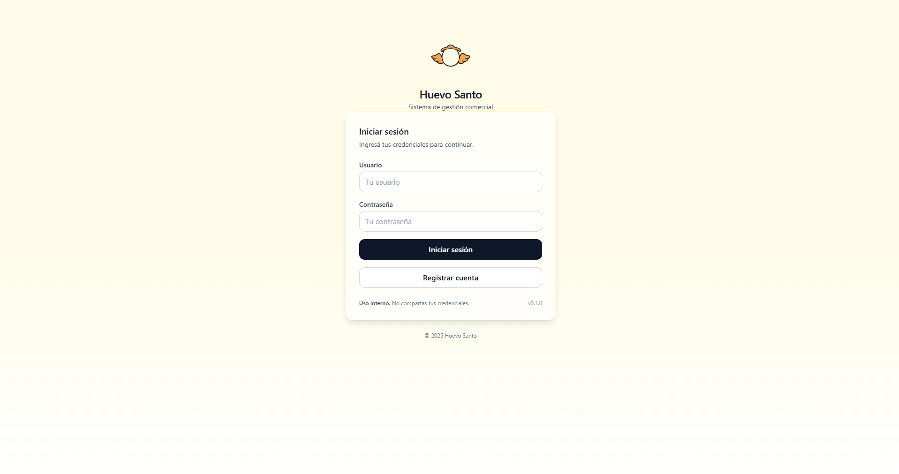
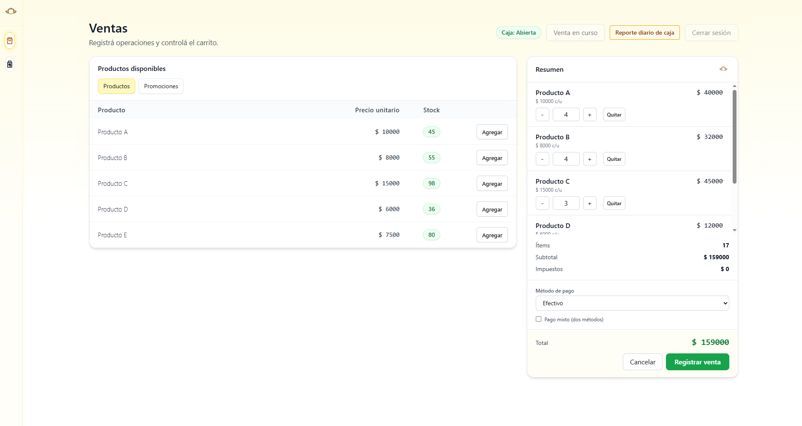
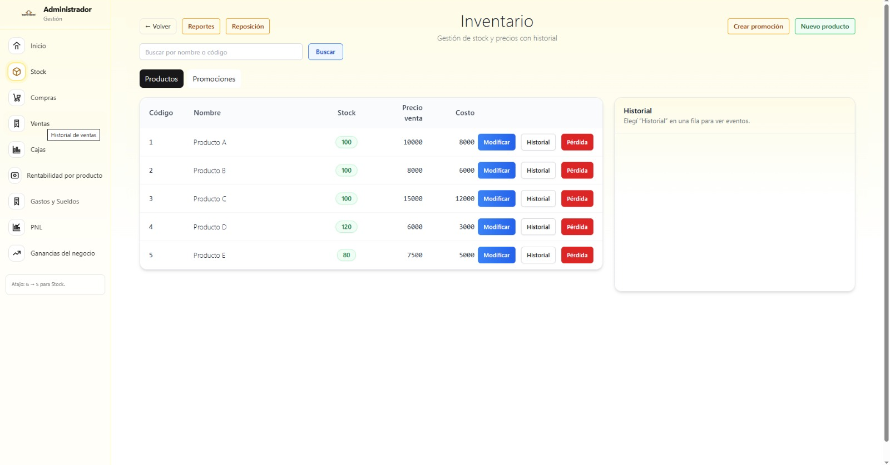
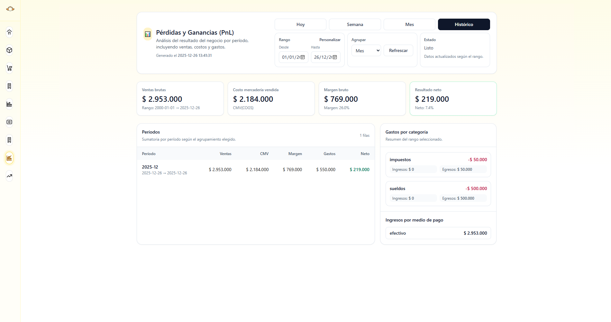
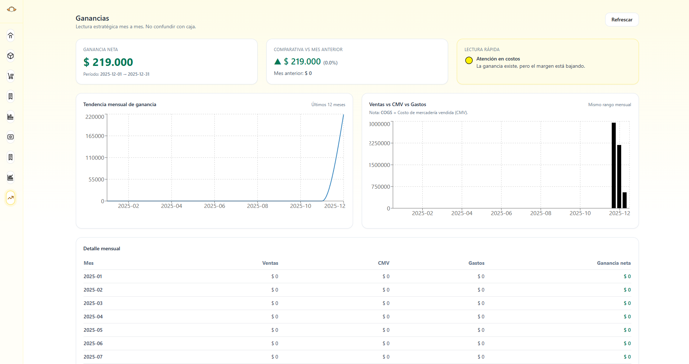

# Sistema Desktop de Ventas, Stock y Caja
Freelance
Aplicación de **escritorio** para comercios minoristas, diseñada para operar **offline**, con módulos integrados de **ventas**, **stock** y **caja**.  
El sistema persiste toda la información localmente y mantiene historial completo de operaciones para control y auditoría.

---

## Problema que resuelve

En muchos comercios pequeños y medianos es habitual:
- Registrar ventas de forma manual o en planillas
- Tener desfasajes entre el stock real y el registrado
- No contar con cierres de caja claros ni horarios consistentes
- No poder reconstruir qué ocurrió ante errores o faltantes

Este sistema centraliza la operación diaria y asegura que:
- Cada venta impacte directamente en el stock
- La caja quede registrada con apertura y cierre por jornada
- Todas las operaciones queden guardadas para su posterior análisis

---

## Funcionalidades

### Ventas
- Registro de ventas con detalle por producto
- Cálculo automático de totales
- Descuento de stock por cada ítem vendido
- Persistencia de la venta y su detalle para auditoría

### Stock
- Alta y edición de productos
- Visualización de stock actual
- Registro de movimientos (mermas, ajustes)
- Base para reportes de inventario e históricos

### Caja
- Apertura y cierre de caja con timestamps
- Asociación de movimientos a cada jornada
- Estructura preparada para reportes diarios y por rango

### Usuarios y roles
- Inicio de sesión y registro
- Roles diferenciados (admin / operador)
- Acceso a vistas según rol

---

## Tecnologías y arquitectura

- **Frontend:** React + TypeScript + Tailwind CSS  
- **Desktop:** Tauri  
- **Backend:** Rust (comandos Tauri)  
- **Base de datos:** SQLite  
- **Acceso a datos:** SQLx + migraciones

La elección de SQLite permite una aplicación liviana, confiable y completamente offline, adecuada para el uso diario en entornos de escritorio.

---

## Modelo de datos (resumen)

Tablas principales:
- `usuario`: credenciales y rol
- `producto`: catálogo de productos
- `caja`: aperturas y cierres por jornada
- `venta`: cabecera de la operación
- `venta_detalle`: productos, cantidades y datos asociados a la venta

El esquema separa cabecera y detalle para mantener trazabilidad y facilitar reportes posteriores.

---

## Flujo de una venta

1. El operador inicia sesión
2. Selecciona productos y cantidades
3. Se validan los datos ingresados
4. Se registra la venta
5. Se registran los ítems de la venta
6. Se actualiza el stock de cada producto
7. La operación queda persistida

Las operaciones críticas están pensadas para ejecutarse de forma atómica, evitando inconsistencias entre ventas y stock.

---

## Estructura del repositorio

- `src/` → frontend (React / TypeScript)
- `src-tauri/` → backend en Rust y comandos Tauri
- `src-tauri/migrations/` → migraciones SQL
- `docs/screenshots/` → capturas del sistema

---

## Capturas

- Login: `docs/screenshots/01_login.png`
- Ventas: `docs/screenshots/02_venta.png`
- Stock: `docs/screenshots/03_stock.png`
- Panel / resultados: `docs/screenshots/04_pnl.png`
- Ganancias: `docs/screenshots/05_ganancias.png`
- Caja: `docs/screenshots/06_cajas.png`

Ejemplo:

  
  
  
  
  

## Ejecución en desarrollo

### Requisitos
- Node.js
- Rust toolchain
- Tauri CLI
- SQLx CLI (opcional, para manejo manual de migraciones)

### Pasos generales
1. Instalar dependencias del frontend
2. Ejecutar la aplicación en modo desarrollo con Tauri
3. La base de datos se inicializa y migra según la configuración del proyecto

> En entornos Windows, la base de datos se ubica en el directorio de datos de la aplicación (`AppData/Roaming/...`).

---

## Estado del proyecto

-  Autenticación y roles
-  Persistencia base (ventas y stock)
-  Interfaz de ventas, stock y caja
-  Consolidación de caja y transacciones completas
-  Reportes avanzados de stock (rentabilidad y reposicion), ventas, costos, gastos, ganancias y rentabilidad del negocio.

---

## Autor

Lautaro Bastari  
GitHub: https://github.com/LautaroBastari

Documentación detallada: https://drive.google.com/drive/folders/1ROyFuz2DuQomwt8iiL6bmKo52x8VZIuo?hl=es-419
